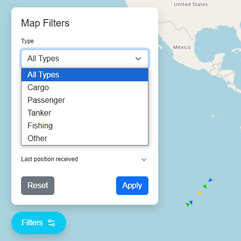
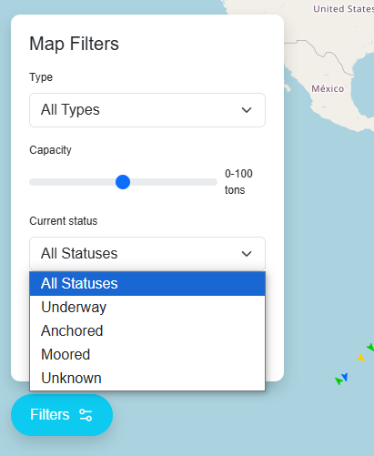
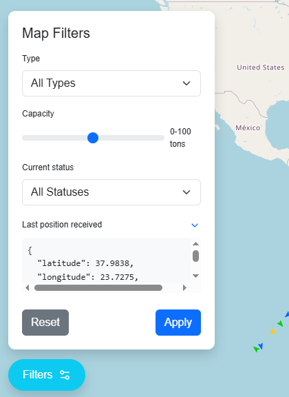
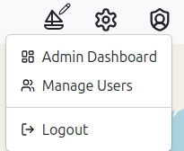

# UI Prototypes

## Index Page

## User
### User Page

### User Dropdown

### User Notifications

### Saved Vessels

## User Filters
### User Filters Button

### User Filters

### User Filters Type

### User Filters Current Status

### User Filters Last Position Received

## Admin

## Administrator Page

## Administrator Dropdown

## Login Form
### Login Empty

### Login Filled

## Signup Form
### Signup Page

### Signup Empty

### Signup Filled

### Signup Select Country

